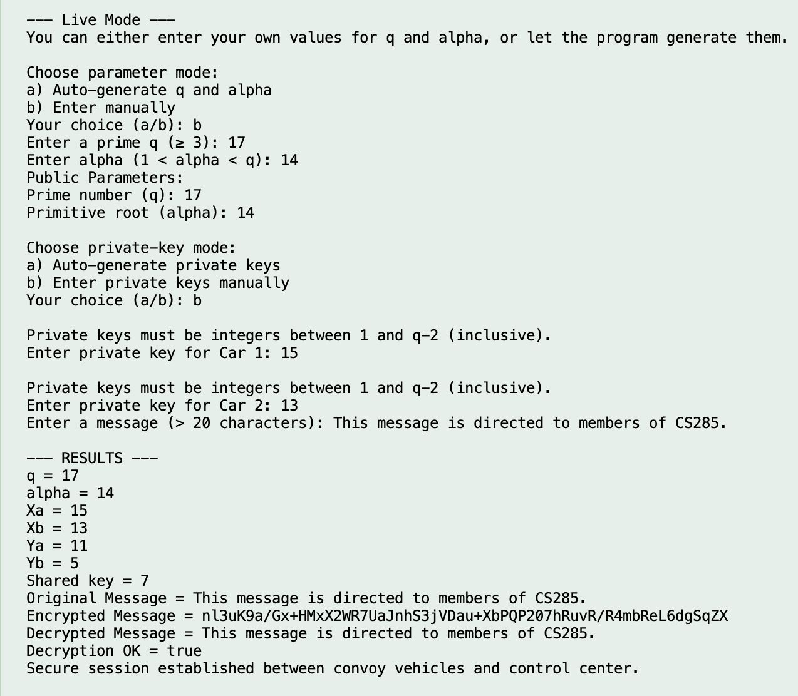
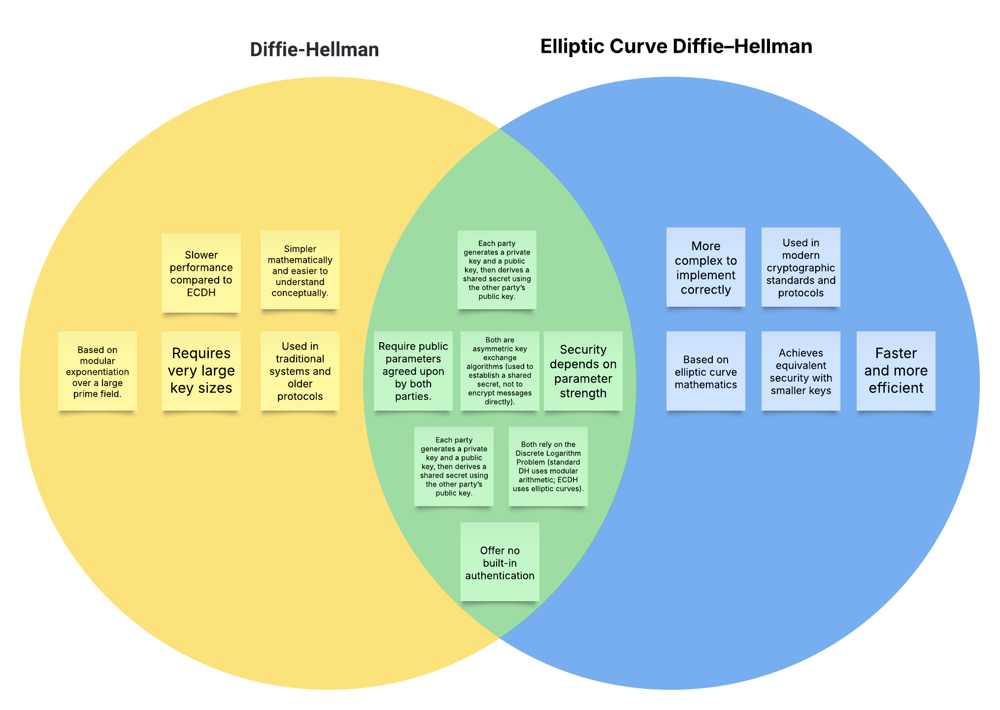

# Results & Test Cases

This section presents the output of the implemented **Diffie–Hellman key exchange system** in both *Numerical Example* and *Live Mode*.  
Each result validates the correctness of the shared key computation, encryption, and decryption stages.

---

## Live Mode – Manual Example

In the **manual live mode**, users provide all parameters manually: the prime number \( q \), primitive root \( \alpha \), and message text.  
The program validates each input and prevents invalid entries until valid parameters are provided.

Once both users (A and B) select their private keys, the program calculates and displays their public keys, followed by the shared key, encrypted message, and decrypted message.  
Successful decryption proves that both participants derived the same shared key.

!!! note "Observation"
    This confirms that the program correctly implements the mathematical logic of the Diffie–Hellman key exchange algorithm.

---

## Live Mode – Alpha Error

This test demonstrates **input validation and error handling**.  
If the user enters a primitive root \( \alpha \) outside the valid range \( 1 < \alpha < q \), the program rejects it and prompts the user to re-enter the value.

Such validation ensures that invalid parameters do not disrupt the computation or cause a program crash.  
The system continues to request valid input until a proper value is provided.

!!! tip "Validation Mechanism"
    The `Validator` and `Helpers` classes work together to ensure that both the prime number \( q \) and the primitive root \( \alpha \) meet mathematical constraints before proceeding.

---

## Numerical Example (Fixed)

This example uses small integer values to **visually demonstrate** how two users can derive the same shared secret key step-by-step.  
Although the numbers are small, the logic mirrors real-world key exchange systems that operate with very large primes.

| **Parameter** | **Value** |
|----------------|-----------|
| Prime number (q) | 7 |
| Primitive root (α) | 6 |
| Private key Xₐ | 5 |
| Private key Xᵦ | 3 |
| Shared key (K) | 1 |

!!! example "Result Verification"
    Both participants derive the same shared key, confirming successful implementation.  
    This test serves as an educational demonstration of the core concept behind the Diffie–Hellman key exchange.

---

## Comparison: Diffie–Hellman (DH) vs. Elliptic Curve Diffie–Hellman (ECDH)

To provide broader context, this diagram compares the **traditional Diffie–Hellman (DH)** and **Elliptic Curve Diffie–Hellman (ECDH)** methods.

| **Aspect** | **DH** | **ECDH** |
|-------------|--------|----------|
| Mathematical Basis | Modular exponentiation | Elliptic curve point multiplication |
| Key Size | Larger (requires big primes) | Smaller (same security with shorter keys) |
| Computational Efficiency | Slower | Faster |
| Security Strength | Strong but depends on prime size | Stronger per bit; harder to break |
| Use Cases | Older implementations (VPNs, SSH) | Modern secure systems (TLS 1.3, Signal) |

!!! note "Summary"
    Both algorithms achieve the same goal — establishing a shared secret key over an insecure channel.  
    However, **ECDH provides greater efficiency and stronger security with smaller key sizes**, making it the preferred approach in most modern cryptographic protocols.